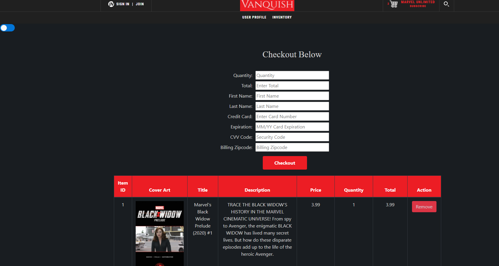
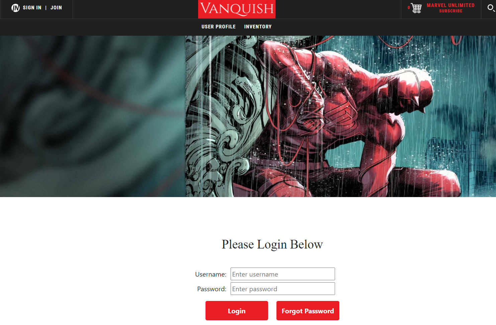
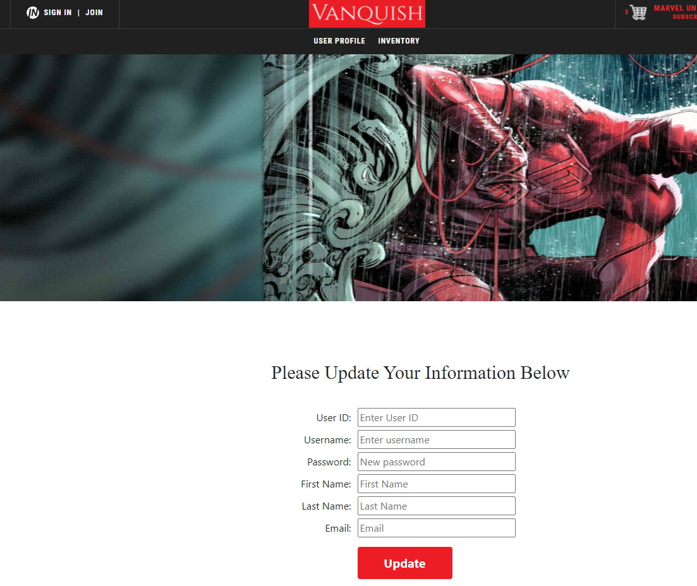
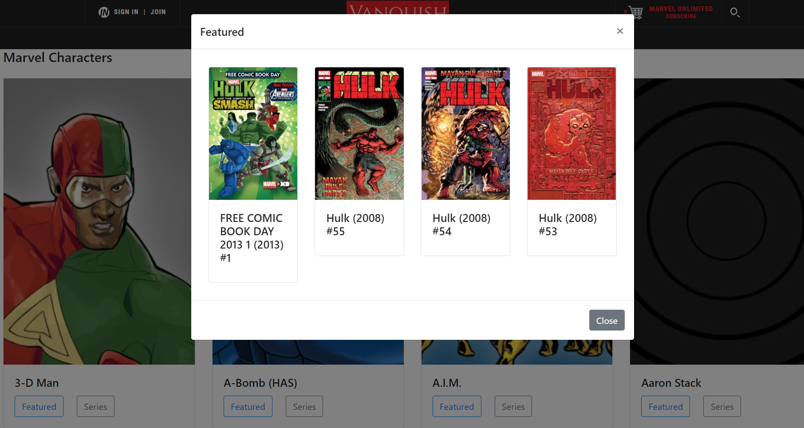
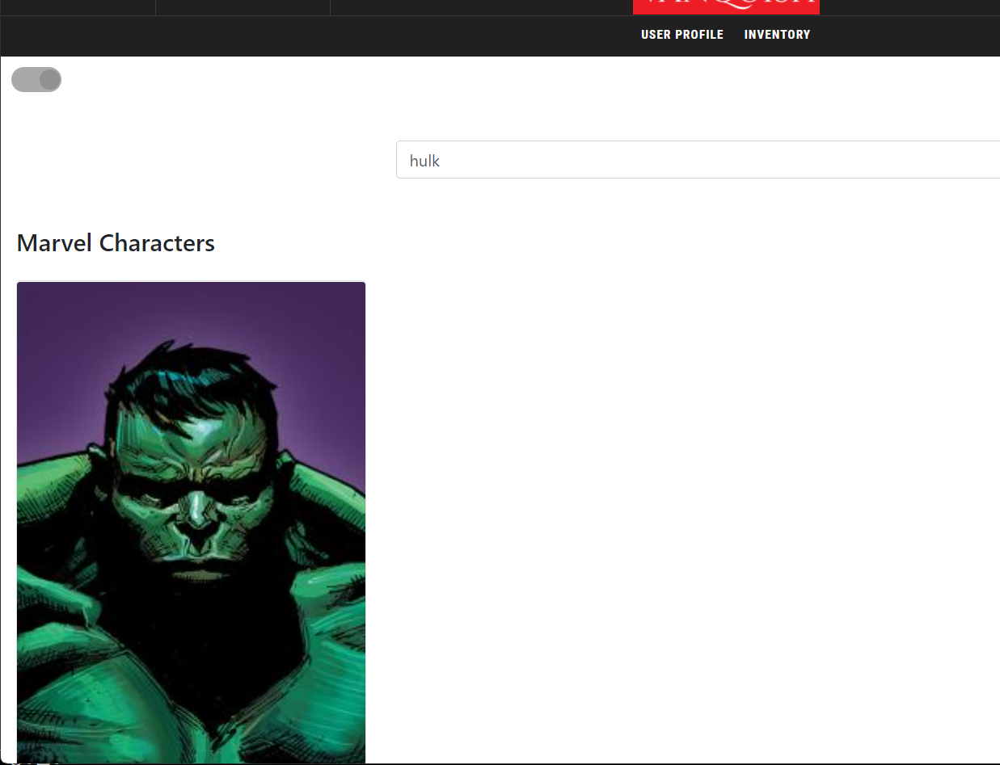
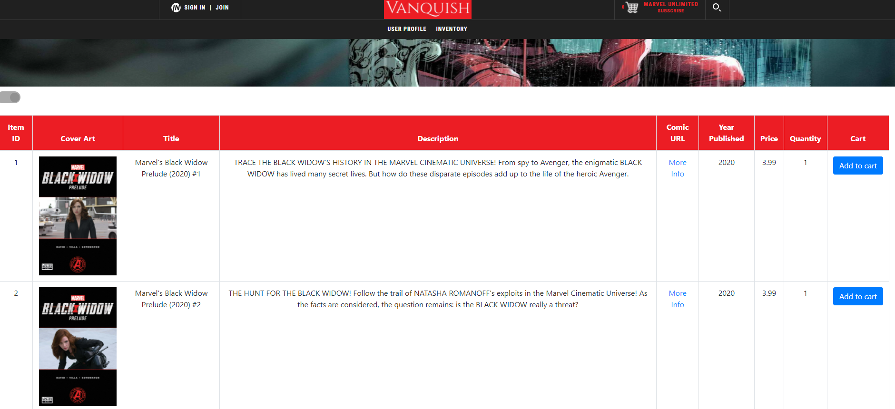
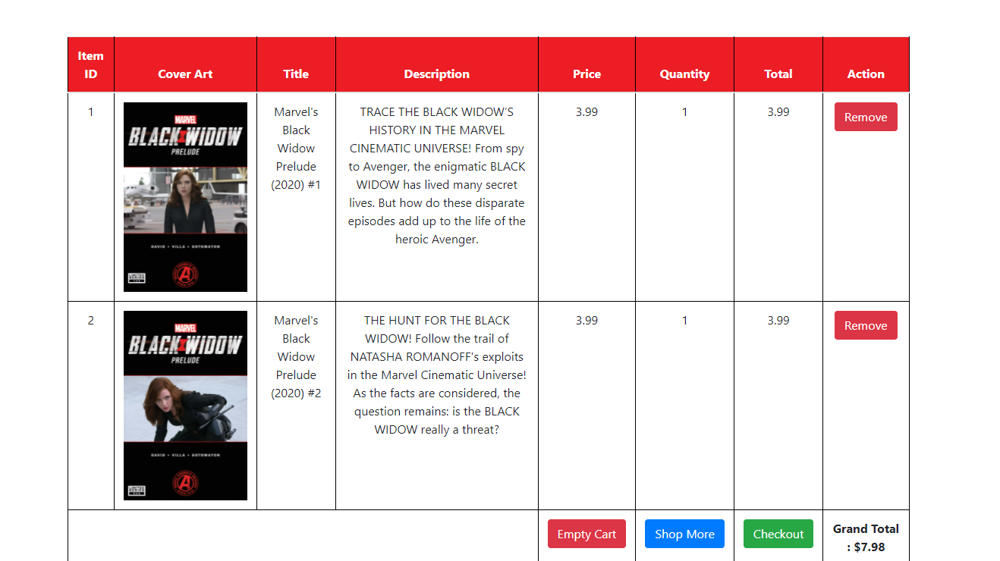
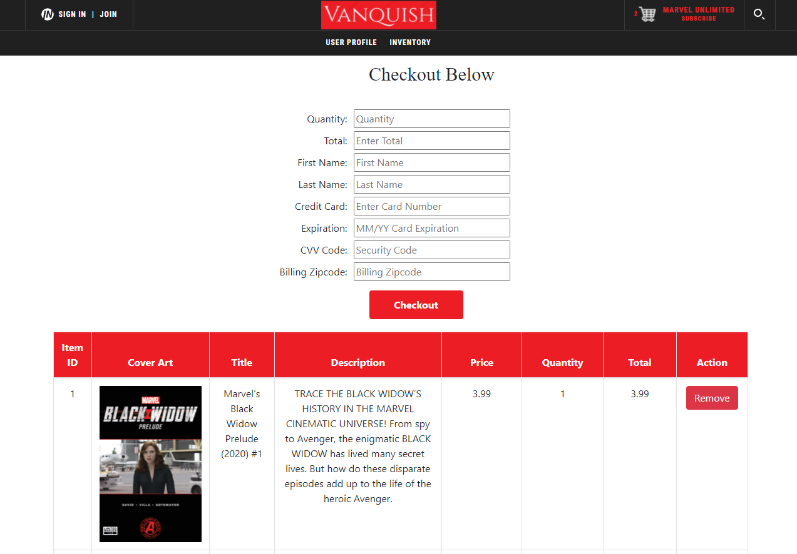

<div id="top"></div>


<!-- PROJECT LOGO -->
<br />
<div align="center">
  <a href="https://github.com/medinaadvising/RevComicPrG3">
    
  </a>

<h1 align="center">Vanquish Comics</h1>

  <p align="center">
    Vanquish Comics will manage the selling of digital comic books over the internet, and the transfer of data to execute the transactions. Customers can log into the online comic book store. New customers can register for an account. Customers can search comics by character and character ID. Customers add comics to cart and checkout. Inside the cart, a customer can add, remove item or empty cart. Customers can view current inventory and select comics to add into cart before purchasing. Each customer will have a user profile that will display their account information. There is also a reset password section that will allow customers to reset their password and update their information. Once a character is selected, customers can view featured comics based on the character. There is also a dark mode that can be toggled on and off.
    <br />
 
</div>


<!-- ABOUT THE PROJECT -->
## About The Project


<p align="right">(<a href="#top">back to top</a>)</p>


### Built With

<p align="center">The back-end system will use Object Relational Mapping Framework - Hibernate to connect to a Postgres database which will be hosted remotely on GCP Cloud SQL, map the database tables, and manipulate the data in the database. The middle tier will use Javalin technology for dynamic Web application development. The front-end view will use HTML/CSS/ Angular to make an application that can call server-side components in a generally RESTful manner. The middle tier will follow proper layered architecture, and have reasonable JUnit test coverage of the service layer. Webpages will be styled to be functional and readable.</p> <br>

* [Java](https://www.oracle.com/java/technologies/java-se-glance.html)
* [Spring](https://spring.io/projects)
* [Node.js](https://nodejs.org/en/)
* [TypeScript](https://www.typescriptlang.org/)
* [Angular](https://angular.io/)
* [Bootstrap](https://getbootstrap.com)
* [JQuery](https://jquery.com)
* [PostgreSQL](https://www.postgresql.org/)
* [Maven](https://mvnrepository.com/)
* [DBeaver](https://dbeaver.io/)
* [Hibernate](https://hibernate.atlassian.net/jira/projects)
* [GCP](https://console.cloud.google.com)
* [Javalin](https://javalin.io/)

<p align="right">(<a href="#top">back to top</a>)</p>


<!-- GETTING STARTED -->
## Getting Started


### Installation


1. Clone the repo
   ```sh
   git clone https://github.com/medinaadvising/RevComicPrG3.git
   ```
2. Install NPM packages
   ```sh
   npm install
   ```


<p align="right">(<a href="#top">back to top</a>)</p>


<!-- USAGE EXAMPLES -->
## Usage

### Dark Mode
<br>
<br>
<br>

### Sign-In 
<br>
<br>
<br>

### Register New Customer
<br>
<br>
<br>

### Reset Password
<br>
<br>
<br>

### Show Featured Comics
<br>
<br>
<br>

### Search Character
<br>
<br>
<br>

### Inventory
<br>
<br>
<br>

### Add To Cart
<br>
<br>
<br>

### Checkout
<br>
<br>
<br>

<p align="right">(<a href="#top">back to top</a>)</p>


<!-- ROADMAP -->
## Roadmap

- [ ] Add Comics purchased to user profile.
- [ ] Auto-fill user and cart details to checkout form.


<p align="right">(<a href="#top">back to top</a>)</p>


<!-- CONTRIBUTING -->
## Contribute To Project

Contributions are what make the open source community such an amazing place to learn, inspire, and create. Any contributions you make are **greatly appreciated**.

If you have a suggestion that would make this better, please fork the repo and create a pull request.
Don't forget to give the project a star! Thanks again!

1. Fork the Project
2. Create your Feature Branch (`git checkout -b feature/<branchName>`)
3. Commit your Changes (`git commit -m 'Comment additions'`)
4. Push to the Branch (`git push origin feature/<branchName>`)
5. Open a Pull Request

<p align="right">(<a href="#top">back to top</a>)</p>


<!-- CONTACT -->
## Team Contributors 

### Omniya Abugour
### Sophie Zhang
### Tyler Hodge
### Erling Wang
### Reginald Leandre
### Jose Medina


<p align="right">(<a href="#top">back to top</a>)</p>


